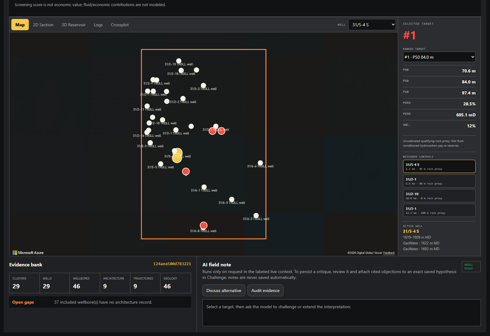
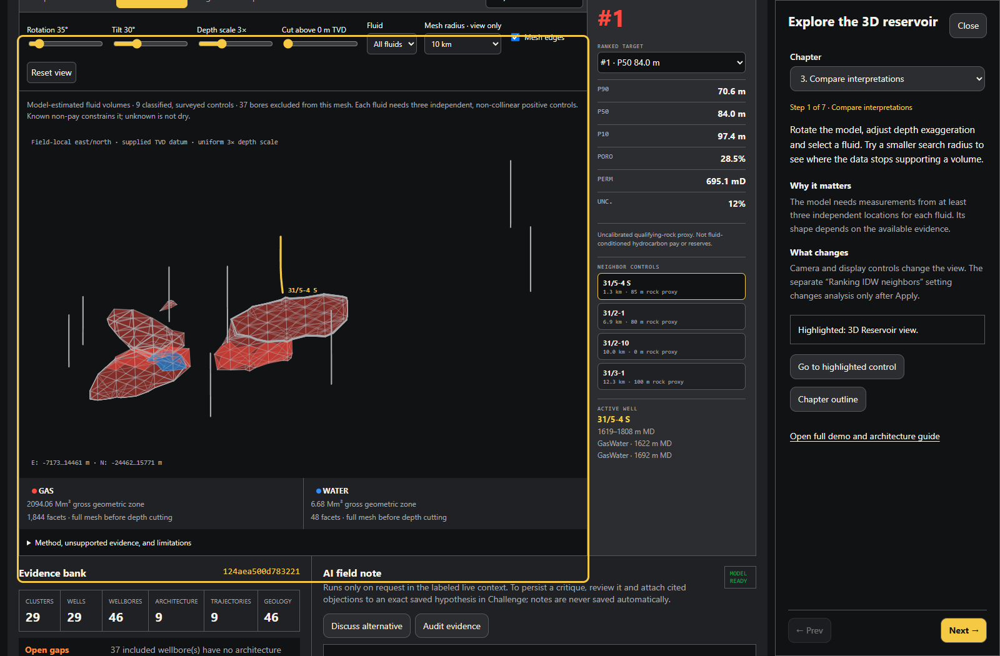
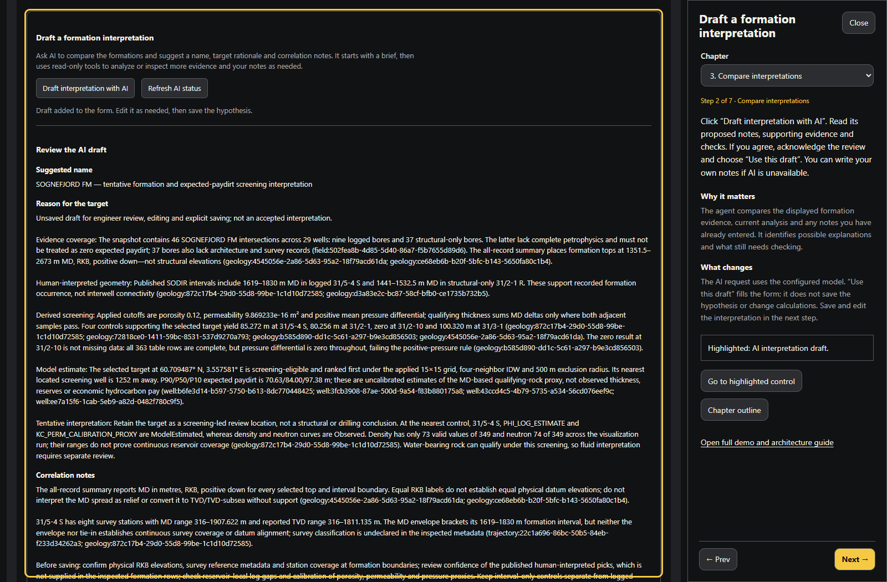
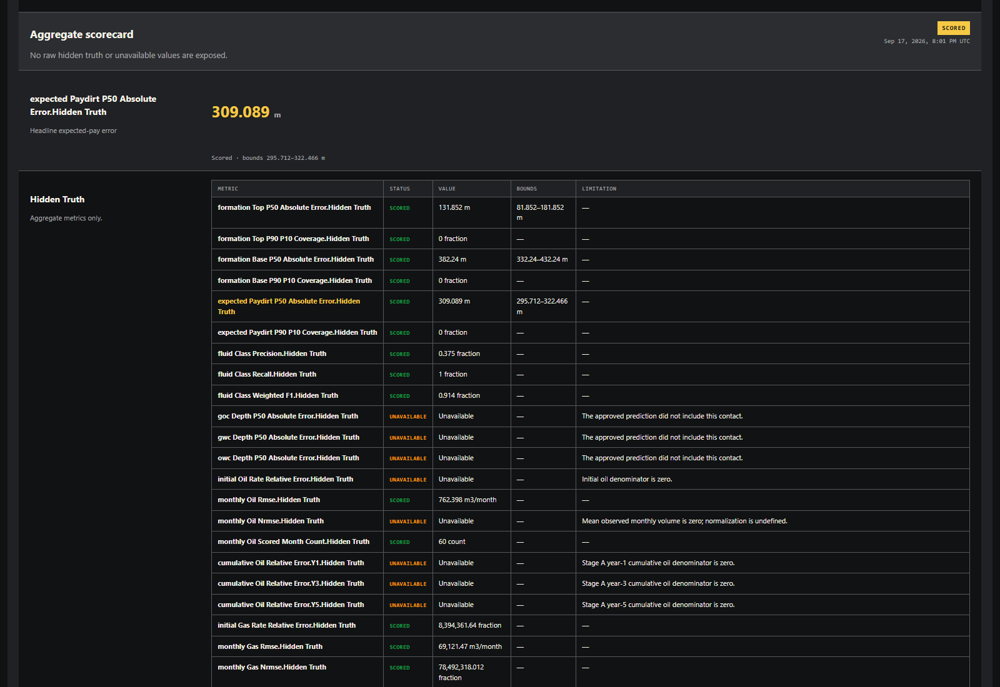

# DrillSim

DrillSim is an independent .NET 10 and Aspire monorepo built from the
MIT-licensed drilling microservices originally published by the
[Open Source Drilling Community (OSDC)](https://github.com/Open-Source-Drilling-Community).
It brings the services and Cluster web application into one solution that can
be built, launched, observed, and managed together.

> [!IMPORTANT]
> This repository is maintained independently by Zachary Way. It is not
> maintained by, affiliated with, or endorsed by OSDC.

## What is included

- 20 drilling service APIs, a .NET analysis API, a React interpretation
  workstation, and the Cluster Blazor web application
- .NET Aspire orchestration, service discovery, health checks, and telemetry
- A persistent Aspire-managed SQLite database for each service
- OpenAPI documents with Scalar API reference pages
- Model Context Protocol (MCP) endpoints

## See the workflow

The [illustrated demo guide](docs/index.html) explains all **19 engineering
tasks** with inline UI screenshots. Its **39 tutorial steps in Chapters 1–4**
were validated end to end. The September 16, 2026 run used the real services
and AI model, then completed a new simulation with **60 production months and
94 evaluation metrics**. Existing field records and completed scenarios remained
unchanged.

See [Preflight & datasets](docs/index.html#preflight) for the complete local
setup, sample-data imports, simulator model preparation and backup/reset steps.

**Locate the next prospect.** Azure Maps places the offshore field's wells and
ranked targets alongside P90/P50/P10 estimates, nearby controls and evidence
coverage.

[](docs/screenshots/showcase-map.png)

**Explore the reservoir.** Inspect formation intervals, fluid estimates, survey
trajectories and nearby drilling targets. Camera and mesh controls are separate
from the applied ranking settings.

[](docs/screenshots/showcase-reservoir.png)

**Draft and compare interpretations.** A local Agent Framework agent retrieves
evidence with read-only tools. Review its citations before accepting the notes;
save and compare exact hypothesis revisions separately.

[](docs/screenshots/chapter-3-step-02.png)

**Run a simulation from the GUI.** Create a scenario, review the editable
forecast, save, seal and approve it. Choose the model preset and resolution,
prepare and start the simulator, approve completion, then publish and evaluate.
The example forecasts and resulting production are synthetic workflow data,
not calibrated commercial predictions.

[](docs/screenshots/showcase-evaluation.png)

Select an image to open its full-page capture. The guide also includes
[production charts](docs/screenshots/showcase-production.png), per-step actions
and expected results, and the application architecture.

## Prerequisites

- [.NET SDK 10.0.400](https://dotnet.microsoft.com/download/dotnet/10.0)
  or a compatible .NET 10 feature-band SDK
- [Aspire CLI 13.5.3](https://aspire.dev/get-started/install-cli/) or newer
- Node.js 22.12+ or 24 LTS with npm, and PowerShell 7 for the commands below
- Azure CLI and a development subscription with resource-creation and
  role-assignment permissions, plus access and quota for the configured model
- Python 3.10+ for sample-data imports

## Get started

```powershell
git clone git@github.com:seiggy/drillsim.git
Set-Location .\drillsim

dotnet restore .\DrillSim.slnx
dotnet build .\DrillSim.slnx --no-restore
npm ci --prefix .\src\DrillSim.AnalysisWeb
aspire certs trust
az login
aspire run
```

On first launch, answer Aspire's Azure setup prompts for any missing tenant,
subscription, resource group and location settings. Aspire creates Azure Maps,
Foundry and the model deployment, configures access and passes their connection
information to the Analysis API. The rest of the application stays local.
Provisioning can take several minutes and creates billable Azure resources;
later launches reuse the saved setup. See [Azure dependencies](#azure-dependencies)
for existing resources, model options and an offline mode.

If you use AzEnv, initialize the intended profile before `az login` and `aspire run`.
Otherwise, Azure CLI's default profile works without additional configuration.

Open the Aspire dashboard URL printed by `aspire run`. The dashboard provides
the dynamically assigned endpoints for the Cluster UI, service APIs, logs,
traces, health status, and SQLite resources.

Stop the application with:

```powershell
aspire stop
```

SQLite files are persisted under `data\` and are excluded from source control.
After the first setup, `aspire start` can launch the app in the background.
Stopping the AppHost or resetting local data does not delete its Azure resources.

## Validation

Use Release outputs while Aspire runs Debug resources:

```powershell
dotnet test .\DrillSim.slnx -c Release --nologo
.\scripts\test_service_contracts.ps1
```

The solution includes AppHost parameter tests, the Analysis API, Drilling Operations, and Reservoir
Simulation test projects; it does not include every legacy test project.
The second command runs twelve additional self-contained service-contract
projects, including in-process Earth-service HTTP/MCP tests, isolated controller
tests, and explicitly selected local fixtures from mixed test projects. Their
test frameworks and MCP client contracts match the .NET 10 services.

Legacy REST/MCP fixtures hardcoded to `localhost:5001` or `localhost:8080` are
not run by this command: some mutate their target service. Do not point them at
the seeded application or an unrelated local app. Model and unit-conversion
library tests are separate from both commands. Passing these suites does not
establish calibration accuracy or complete live distributed-system coverage.

## Service endpoints

Ports are assigned at launch. Open a service from the Aspire dashboard, then
use these paths:

| Path | Purpose |
| --- | --- |
| `/swagger` | Scalar API reference |
| `/swagger/v1/swagger.json` | Generated OpenAPI document |
| `/health` | Readiness health check |
| `/alive` | Liveness health check |
| `/mcp` | MCP HTTP transport, where implemented |
| `/mcp/ws` | MCP WebSocket compatibility transport, where implemented |

The AppHost advertises implemented public HTTP MCP endpoints at their service
base paths. Discover and exercise them through Aspire:

```powershell
aspire mcp tools --non-interactive
aspire mcp call field ping --input '{}' --non-interactive
```

Geological Properties, Trajectory, Drilling Fluid, Geothermal Properties, and
YPL Calibration currently use REST rather than HTTP MCP. Some other services
advertise connectivity-only tools; discovery does not imply complete CRUD tool
coverage. Hidden Reservoir Simulation and internal Drilling Operations are
intentionally not advertised as public MCP servers.

## Analysis workstation

The `analysis-web` resource provides the Hypothesis Sequencer field-analysis
portal. Its deterministic field package and expected-paydirt analysis work
without a model connection. Aspire exposes it at the stable development origin
`http://localhost:5173` for Azure Maps CORS configuration.

### Demo guide and guided tutorial

Open **Demo & architecture guide** in the app for the HTML presenter script, or
open [`docs/index.html`](docs/index.html) directly in a browser. It covers every
task, the engineering inputs and outputs, and the services behind the workflow.
The same document is the repository's GitHub Pages site. The Pages workflow
publishes it after these files reach `main`; select **GitHub Actions** under the
repository's **Settings → Pages → Build and deployment**. Pages serves the guide,
not the running simulator.

Choose **Guided tutorial** to follow four short chapters in the app. The yellow
outline identifies the relevant control. Use **Prev** and **Next**, skip an
exercise, or close the tutorial at any time. The grid exercise waits for your
actual Apply result; tutorial navigation never applies settings or saves records.
Any edits you make remain after you close the tutorial.

The Field menu distinguishes **Original data** from **Simulated results**.
Simulated results include a scenario description and date. Scenario status is
shown separately from its name: **Scored** means evaluation is complete.
These labels do not rename or merge stored fields.

In **Correlation**, choose **Draft interpretation with AI** to generate a proposed
name, target rationale and formation notes from the displayed evidence and applied
settings. The request includes your current notes; a loaded hypothesis uses its
saved evidence. Review the citations and limitations, then choose **Use this
draft** to fill the form. Existing notes require confirmation before replacement.
**Save hypothesis** remains a separate action. The agent uses the configured
Azure OpenAI connection; unavailable models and invalid responses leave your text
unchanged. Manual notes and the example note remain available.

AI availability reports configuration, not available model capacity. If the
provider returns 429, drafting shows **AI capacity limit reached**, retains your
notes, and makes no automatic retry. Retry only after quota or capacity is available.
In Aspire's `analysis-api` structured logs, `FormationInterpretationFailure`
(event 8300) includes the original exception, its stack and inner exceptions, and
`ProviderStatusCode`, correlated with the HTTP request trace and span. Browser
errors remain sanitized.

All three analysis agents run locally in Microsoft Agent Framework: field notes
(`/agui`), scenario-scoped notes (`/agui/scenario`) and formation drafting.
They use the Responses API so Astra can reason while calling tools.
Response storage and background execution are disabled, and encrypted reasoning
continuation stays within each request's local tool loop. Scenario notes retain
their clock-bound evidence tools; they cannot access unrestricted field evidence.

The formation agent's `invoke_agent` span contains a child model span for
the model request. In **Development**, both spans capture input/output messages,
including notes and field evidence; treat trace exports accordingly. Message
capture is off outside Development. The chat span records token usage when the
provider returns it; a rejected request may have no usage or output. Both layers
use Aspire's existing telemetry source and exporter configuration, with no
separate OTLP endpoint.
The formation agent starts with a small brief rather than sending the complete
dataset on every request. Its read-only tools summarize formation picks, read the
exact applied screening results, search records, inspect formation/log summaries,
and read engineer notes. It can request larger pages or the full prepared context
when the task needs it. Tools operate on the same verified snapshot throughout
the request, and final citations must refer to evidence actually returned.

The initial brief is at most 8 KiB; the complete prepared snapshot retains the
existing 192 KiB safety bound. Generous execution safeguards allow 128 tool calls,
40 function-invocation iterations, 2 MiB of cumulative retrieved data and a
10-minute request deadline. These are runaway-execution limits, not a small-context
target. Cancellation remains available, and provider failures are not retried
automatically.

In **Evidence → Data sources**, records are grouped by dataset, preparation and
classification. Expand the affected wellbores to trace each record to its source.
Shared files, licenses and credits are listed once. Original source, curve and
coordinate metadata is available through JSON downloads rather than raw data dumps.

Tutorial checks use the existing frontend runner:

```powershell
Set-Location .\src\DrillSim.AnalysisWeb
npm run test:tutorial
# Optional browser checks using an already installed Playwright module:
$env:DRILLSIM_PLAYWRIGHT_MODULE = "<absolute-path-to-playwright>\index.mjs"
npm run test:tutorial:browser
```

Aspire automatically generates missing internal service keys and persists them
in the AppHost's user-secrets store. Existing values are reused; neither a
restart nor a dataset reset requires generating new keys.

### Azure dependencies

The AppHost uses `Aspire.Hosting.Foundry` to provision an Entra-only Foundry
account and the `drillsim-chat` model deployment. Its custom
[`azure-maps.bicep`](aspire/DrillSim.AppHost/Infrastructure/azure-maps.bicep)
module provisions an Entra-only Azure Maps account with CORS for
`http://localhost:5173`. Aspire assigns **Cognitive Services OpenAI User** and
**Azure Maps Data Reader** to the local developer identity at their respective
account scopes. No keys, endpoint copying or manual role assignments are needed
for newly provisioned resources.

The defaults are `eastus2`, a resource group prefix of `rg-drillsim`, and
`gpt-6-astra` version `2026-09-03`, using GlobalStandard capacity `100`.
Use an Azure subscription and region with the required model access and quota;
Aspire cannot grant either. Standard `Azure:SubscriptionId`, `Azure:TenantId`,
`Azure:ResourceGroup` and `Azure:Location` settings control the deployment target.
Local provisioning uses `Azure:CredentialSource=AzureCli`, matching the Analysis API.

To change the managed model, set `AzureResources:ModelName` and
`AzureResources:ModelVersion` together in the AppHost's user-secrets store.
`AzureResources:ModelCapacity` controls deployment capacity. The replacement
must support structured responses, the Responses API and function tools;
there is no automatic model substitution.

**Existing connections are preserved.** Complete groups of the following
AppHost parameters bypass provisioning for that service independently:

| Connection | Required `Parameters:` values |
| --- | --- |
| AI | `azure-openai-endpoint`, `azure-openai-deployment-name`, `azure-openai-subscription-id` |
| Maps | `azure-maps-client-id`, `azure-maps-tenant-id`, `azure-maps-subscription-id` |

The AI endpoint must end in `/openai/v1/`. Maps needs the account's client ID,
not a subscription key or app-registration ID. Existing resources must already
have the corresponding data-plane roles and Maps CORS setting; the AppHost does
not change externally configured accounts. Partial groups fail with an
explanatory error. Remove a complete group to switch that service to Aspire
provisioning on the next launch.

**Without Azure**, disable new provisioning before startup:

```powershell
dotnet user-secrets set "AzureResources:Provision" "false" --project .\aspire\DrillSim.AppHost
```

Complete existing connections are still used. Without them, Maps and AI are
unavailable, but the portal's deterministic analysis and local simulator work.
Set the value to `true` to enable provisioning again.

Azure authentication uses `AzureCliCredential`. An existing `AZURE_CONFIG_DIR`
is forwarded to the Analysis API; otherwise the AppHost uses the default
`.azure` directory under the user's home. Credentials are never sent to the
browser. The API brokers short-lived Azure Maps tokens for
`https://atlas.microsoft.com/.default`. A Maps 403 after token acquisition calls
for checking the account client ID and its Data Reader assignment.

### Internal simulation access

The reservoir-simulation operator key is generated when missing and is not referenced by the
analysis API or browser. Drilling Operations is internal-only and receives the
Stage A operator key plus its own internal and future Analysis API callback
credentials; none are forwarded to the browser.

Before S2 generates a drilling path, it registers the approved **Planned** path
with the reservoir service. A path outside the prepared model's coverage is
rejected before drilling or survey artifacts are created. S4 still checks the
**AsDrilled** path, because steering can leave the model even when the plan fits.
The Simulation panel explains which path was rejected and how to proceed:
create a new scenario with a compatible target/path, or have the operator provide
a model covering that location. Changing the seed or Preview/Standard resolution
does not expand the model's area; existing approved paths and failed runs are not rewritten.

In Aspire, the reservoir service logs `ReservoirRequestRejected` (event 8400)
with the HTTP status, diagnostic code and field-by-field validation errors on
the failing request trace. Malformed requests log `ReservoirRequestMalformed`
(8401) with the parse exception. Browser failure messages use known diagnostic
codes rather than forwarding private model details or arbitrary backend text.
Older runs recorded only as `StageADataMismatch` retain that original code;
their missing validation detail cannot be recovered from the old trace.

For an uncommitted S8 publication rejected by a destination service, **New
evidence** can offer **Recover staged publication** after the underlying import
problem is corrected. Inspect the staged fingerprints and operation counts,
enter the local audit label and correction reason, and acknowledge that exact
review. Recovery preserves the same run and staged plan; **Publish reveal and
evaluate** is a separate action with a new attempt key. An uncertain response
must be retried with its saved key, not treated as rollback. Recovery is unavailable
for unrelated failures, changed evidence, or an activated/prepared/committed reveal.
It uses the same local-only antiforgery-protected operator facade; labels are
audit annotations, not authenticated identities.
Architecture and geology cleanup retain every publication-marked record,
regardless of its simulation date. A missing previously verified record blocks
recovery; restoration requires explicit review of the saved immutable payload
and confirmation of its original business hash.

For an eligible rejected scorecard with the historical absolute-error-bound
defect, **Evaluation** offers **Append corrected evaluation**. Review the
original/corrected fingerprints and correction reason before appending the
versioned artifact. The rejected artifact, original inputs and point scores
remain intact. Use **Run / retry evaluation** separately to publish it; neither
operation repeats drilling or publication.

The hidden reservoir service conditions deterministic structured worlds from
logged controls and runs an adaptive immiscible oil/water/gas IMPES kernel. Its
cell truth remains in service memory. An operator can seed the Troll-Sognefjord
world without exposing that truth to the analysis agent:

```powershell
$env:RESERVOIR_SIMULATION_OPERATOR_KEY = "<same operator key>"
python .\scripts\seed_reservoir_world.py
```

## Services

| Aspire resource | Source project |
| --- | --- |
| `cartographic-projection` | CartographicProjection |
| `analysis-api` | DrillSim.AnalysisApi |
| `analysis-web` | DrillSim.AnalysisWeb |
| `cluster` | Cluster |
| `cluster-ui` | Cluster WebApp |
| `drilling-operations` | Internal checkpointed drilling workflow |
| `drilling-fluid` | DrillingFluid |
| `drill-string` | DrillString |
| `earth-gravity` | EarthGravity |
| `earth-magnetic-field` | EarthMagneticField |
| `earth-vertical-datum` | EarthVerticalDatum |
| `field` | Field |
| `geodetic-datum` | GeodeticDatum |
| `geological-properties` | GeologicalProperties |
| `geothermal-properties` | GeothermalProperties |
| `rig` | Rig |
| `reservoir-simulation` | ReservoirSimulation hidden ground-truth service |
| `simulator-4ndof` | Simulator4nDOF |
| `survey-instrument` | SurveyInstrument |
| `trajectory` | Trajectory |
| `unit-conversion` | UnitConversion |
| `well` | Well |
| `well-bore` | WellBore |
| `well-bore-architecture` | WellBoreArchitecture |
| `ypl-calibration` | YPLCalibrationFromRheometer |

## Repository layout

| Path | Contents |
| --- | --- |
| `aspire\DrillSim.AppHost` | Aspire application topology and service wiring |
| `aspire\DrillSim.ServiceDefaults` | Shared telemetry, health, discovery, and resilience configuration |
| `src` | Ported service, model, UI, and supporting projects |
| `data` | Local SQLite databases created at runtime |

## Attribution and license

The projects under `src\` are derived from software published by OSDC under the
MIT License. Their original copyright and license notices remain applicable to
the imported code and its original contributors.

This repository and its independently authored changes are licensed under the
[MIT License](LICENSE), copyright (c) 2026 Zachary Way.
